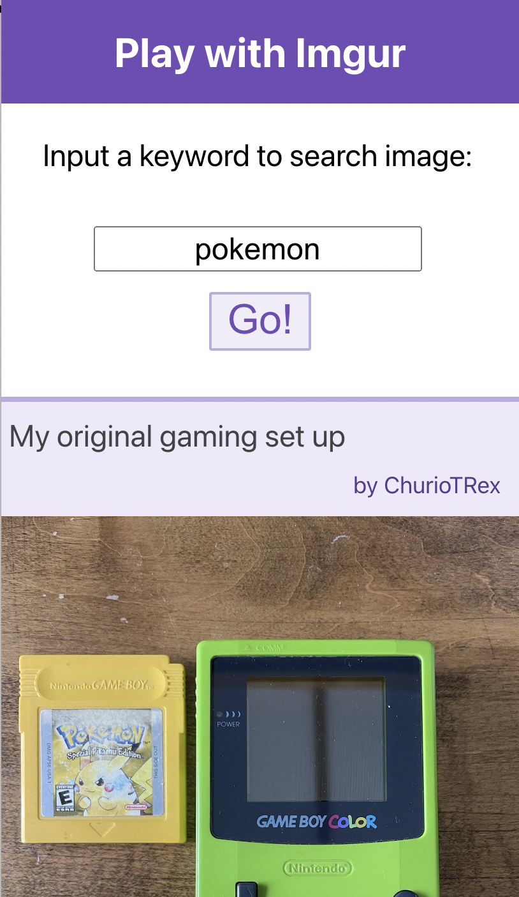

# Test: Search Imgs with Imgur API

## How to use:

1. In the folder that contains "package.json", run `npm install`
2. Run 'npm start'
3. In your web browser, open "0.0.0.0:3000" (not localhost!)
4. If you can see the page you should be good to go
5. Try search some keywords, such as "cat", "dog", "pokemon"!

